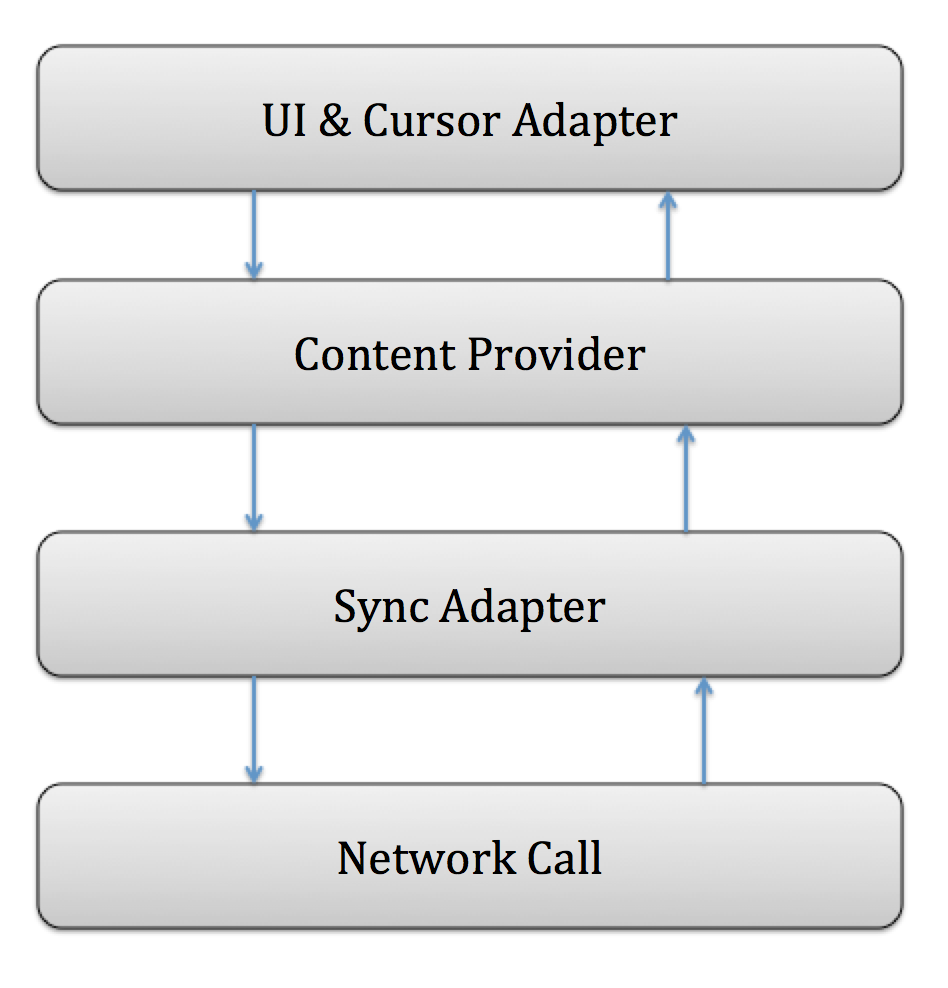

# edmodo
## Architecture

## Flow
UI always tries to get data from content provider instead of network, if data is not there, sync adapter uses Retrofit to get data from network and populates the content provider, then cursor will be updated. This is the only time local gets updated. Some possible improvements are: allowing user to manually sync with server, server sending push notification to client to trigger a sync...
